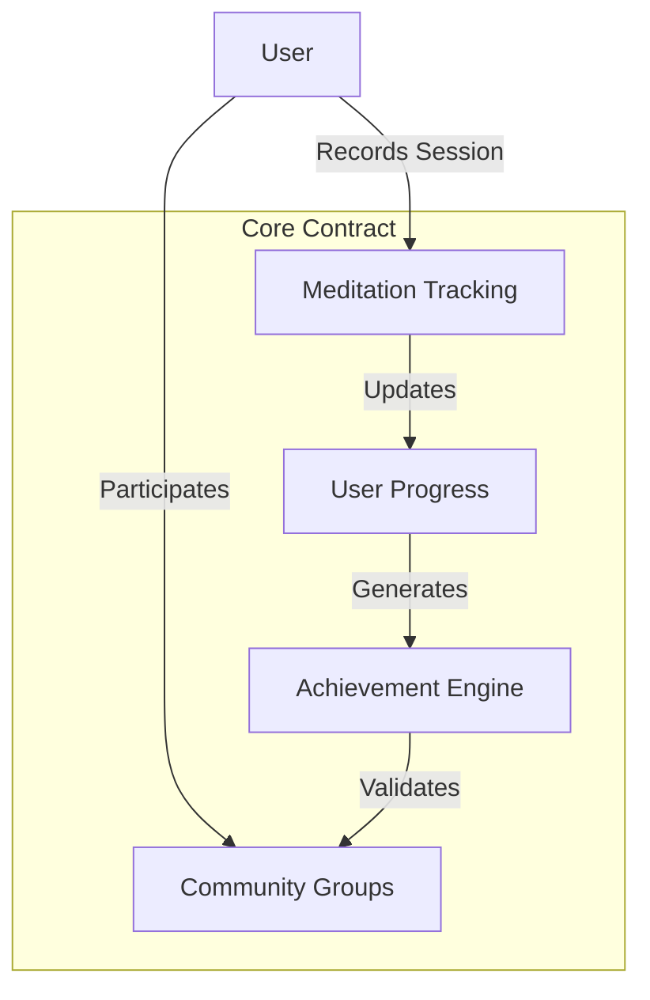

# Plasma Improve: Meditation Tracking Platform

A blockchain-powered solution for tracking, analyzing, and rewarding meditation practices through transparent, immutable digital achievements.

## Overview

Plasma Improve is an innovative digital platform designed to empower meditation practitioners by:
- Providing comprehensive session tracking
- Generating personalized meditation insights
- Creating verifiable digital achievements
- Fostering community engagement through shared progress

Our platform transforms meditation practice into a structured, rewarding journey with blockchain-verified progress and achievements.

## Architecture

The system leverages a core smart contract to manage:
- Precise meditation session recording
- Dynamic achievement generation
- Community group interactions
- Comprehensive user progress analytics



## Contract Documentation

### Core Contract (meditation-tracker.clar)

The primary contract powering Plasma Improve's meditation tracking ecosystem.

#### Key Features
- Meditation session recording and tracking
- Achievement system with multiple categories
- Group management and social features
- Comprehensive user statistics

#### Achievement Types
1. Session Count (milestone-based)
2. Meditation Streaks
3. Total Duration
4. Practice Variety

#### Meditation Types
- Mindfulness
- Focused
- Loving-kindness
- Body Scan
- Transcendental

## Getting Started

### Prerequisites
- Clarinet
- Stacks wallet for contract interaction

### Basic Usage

1. Record a meditation session:
```clarity
(contract-call? .meditation-tracker record-meditation-session 
    u45  ;; duration in minutes
    u2   ;; meditation type (2 = focused)
    (some u"Mindful morning practice") ;; optional notes
)
```

2. Create a community meditation group:
```clarity
(contract-call? .meditation-tracker create-meditation-group 
    "Plasma Practitioners" 
    "Global community of mindful blockchain enthusiasts"
)
```

## Function Reference

### Public Functions

#### record-meditation-session
```clarity
(define-public (record-meditation-session (duration uint) (meditation-type uint) (notes (optional (string-utf8 256))))
```
Records a new meditation session and triggers achievement checks.

#### create-meditation-group
```clarity
(define-public (create-meditation-group (name (string-utf8 64)) (description (string-utf8 256)))
```
Creates a new meditation group with the caller as creator.

#### join-meditation-group
```clarity
(define-public (join-meditation-group (group-id uint))
```
Allows a user to join an existing meditation group.

#### verify-achievement
```clarity
(define-public (verify-achievement (achievement-id uint))
```
Publicly verifies an achievement's authenticity.

### Read-Only Functions

#### get-user-stats
```clarity
(define-read-only (get-user-stats (user principal))
```
Retrieves complete statistics for a user.

#### get-meditation-session
```clarity
(define-read-only (get-meditation-session (user principal) (timestamp uint))
```
Retrieves details of a specific meditation session.

## Development

### Testing
1. Install Clarinet
2. Run the test suite:
```bash
clarinet test
```

### Local Development
1. Start a local Clarinet console:
```bash
clarinet console
```
2. Deploy contracts:
```clarity
(contract-call? .zensync-core ...)
```

## Security Considerations

### Limitations
- Group membership limited to 100 members per group
- Achievement list capped at 100 achievements per user
- Meditation types list limited to 10 types

### Best Practices
- Verify achievement ownership before sharing
- Check group membership before attempting group operations
- Validate all duration and meditation type inputs
- Be aware of streak calculation limitations around time zones